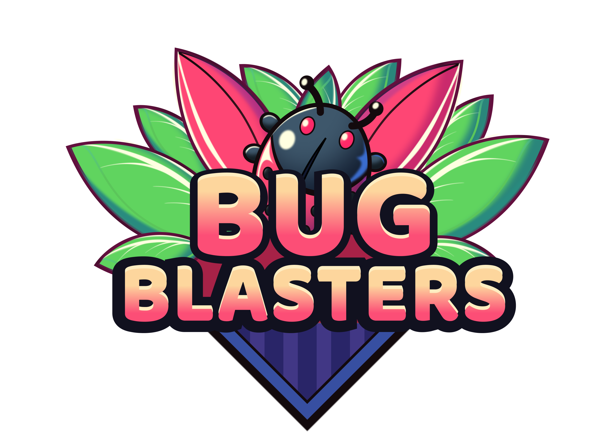
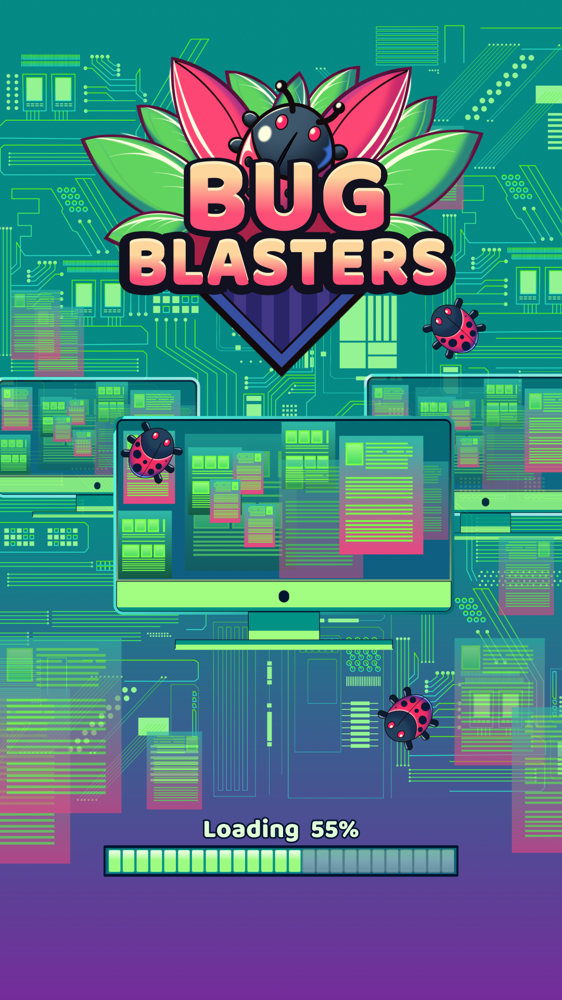
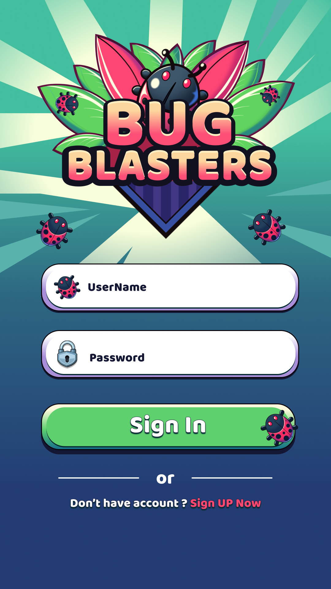
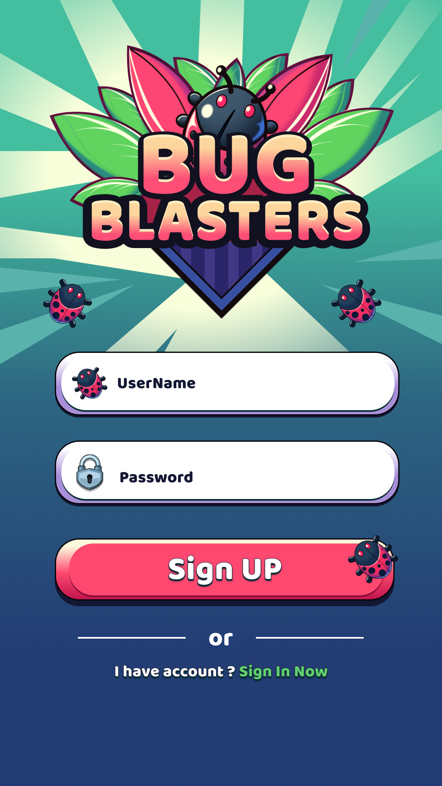
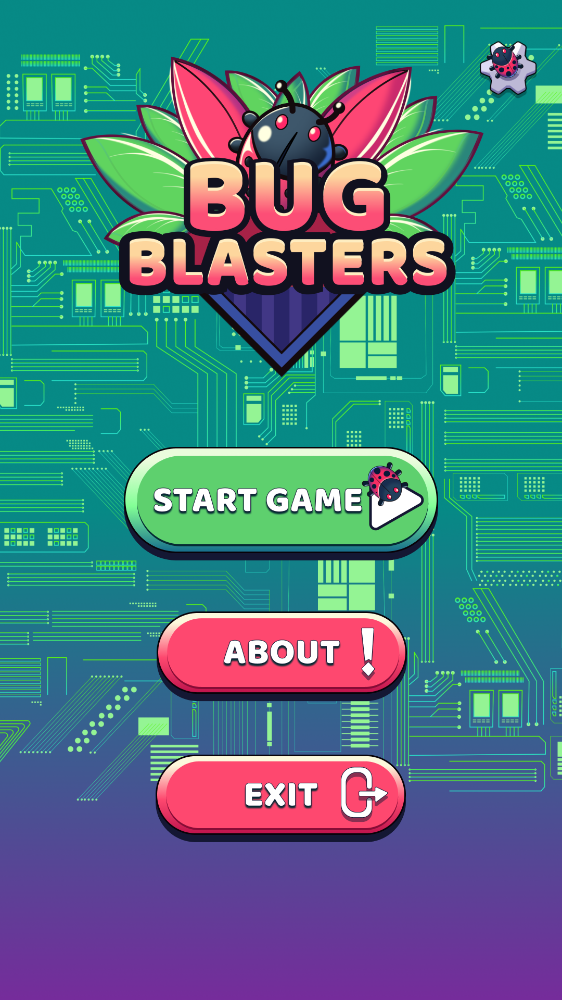
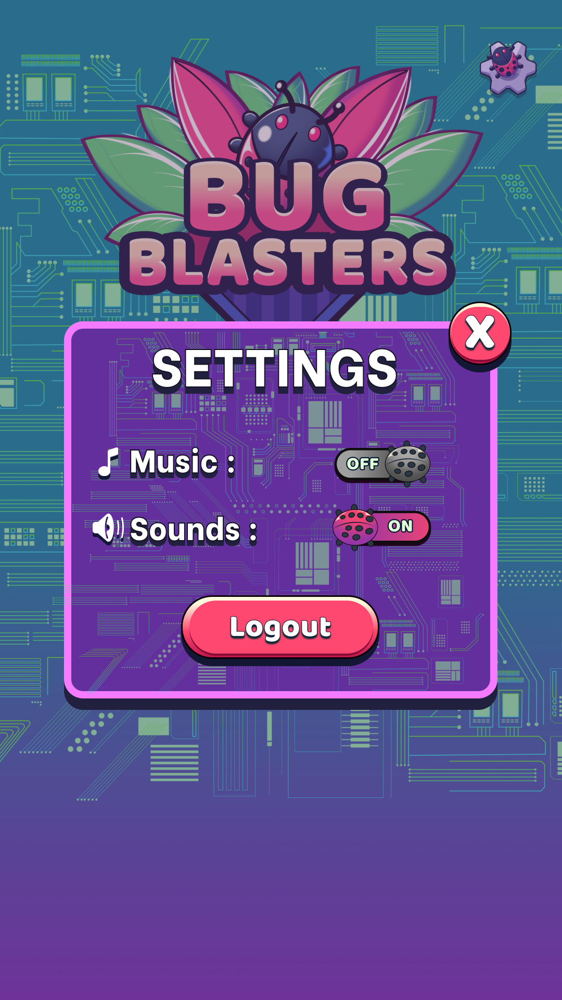
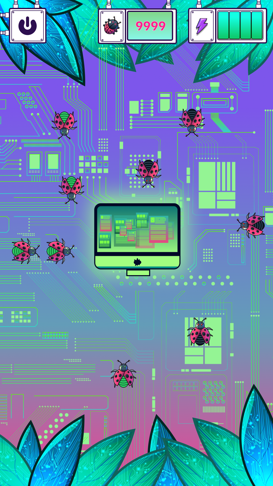
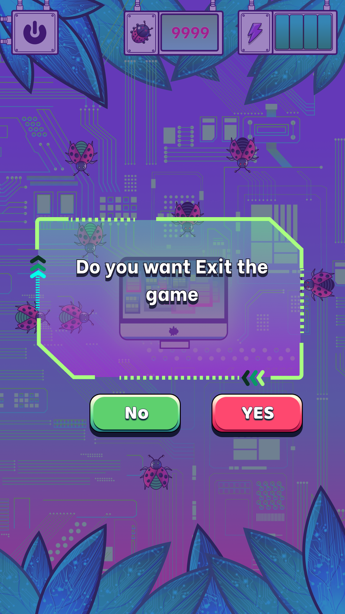

<p align="center">
  
</p>

# Bug Blasters

Tap-to-zap cyber pests before they drain your device! Bug Blasters is a fast 2D arcade game where you protect different devices (Phone → Tablet → Laptop → Desktop → Supercomputer) from waves of black and green bugs. One tap for black, two for green — stay sharp as speed and spawns ramp up each level.

## Demo
<p align="center">
  <a href="https://youtu.be/YCXQ6P1dW1s?si=1vGszuv-H5wOI1dj">
    
  </a>
</p>

## Screenshots
<p align="center"></p>
<p align="center"></p>
<p align="center"></p>
<p align="center"></p>
<p align="center"></p>
<p align="center"></p>
<p align="center"></p>
<p align="center"></p>

## Play it on Android
- **[Bug Blasters – Android APK](BB_ANDROID_APK/BB_Final.apk)**

### Installing the APK
1. Download the APK from the link above.
2. On your Android device: **Settings → Security → Install unknown apps** (enable for your browser/files app).
3. Open the APK and tap **Install**.
4. Launch **Bug Blasters** and play!

## Features
- **Five escalating levels**: Phone, Tablet, Laptop, Desktop, Supercomputer.
- **Two enemy types**: Black bugs (1 tap), Green bugs (2 taps).
- **Device HP bar**: If it hits zero, it’s game over — restart the level.
- **Progressive difficulty**: Bug speed and spawn rate increase as you advance.
- **Clean UX**: Splash, Sign In/Log In, Menu (New/Continue/About/Settings), Level Intro, Game Over.
- **Audio polish**: SFX for taps/eliminations + a catchy background track.

## How to Play
- Tap bugs to eliminate them before they reach the device.
- Each bug that reaches the device reduces HP.
- Clear the required number of bugs to advance to the next level.

## Level Goals
- L1: 15 bugs · L2: 20 · L3: 25 · L4: 30 · L5: 40

## Tech Stack
- **Engine:** Unity (2D)
- **Language:** C#
- **UI/Fonts:** Unity UI · TextMeshPro · Figma
- **Audio:** Unity-compatible SFX/BGM
- **Local Data:** (optional) PlayerPrefs / lightweight storage

## Requirements
- Unity 2023.1.15f1

## Getting Started (Dev)
```bash
# Clone
git clone https://github.com/liscontoli/BugBlasters.git
cd BugBlasters

# Open in Unity
# Unity Hub → Add → select this folder → Open
